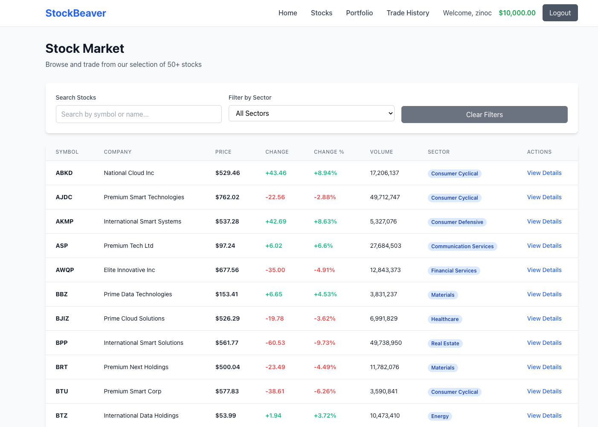
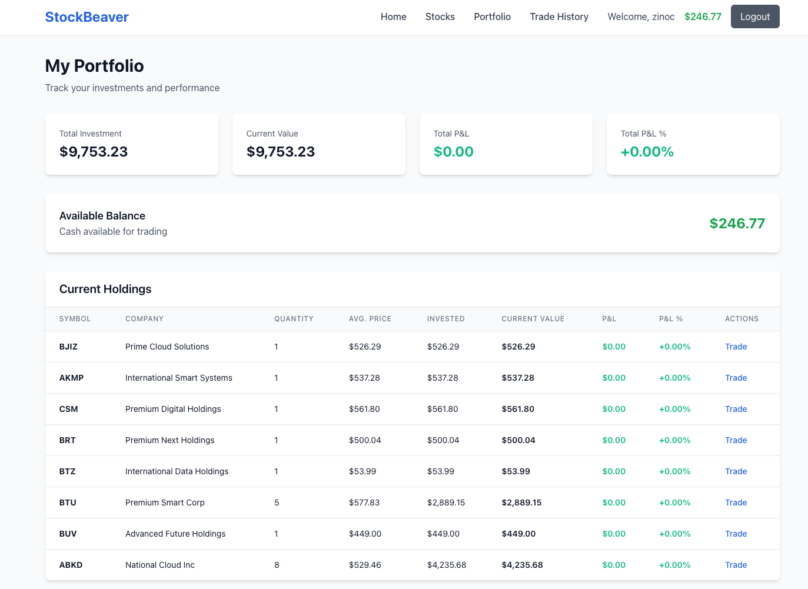

# StockBeaver - MERN Stack Stock Trading Platform

## 📋 Assignment Overview

**StockBeaver** is a full-stack MERN (MongoDB, Express.js, React.js, Node.js) stock trading simulation platform that demonstrates advanced full-stack integration, real-time data handling, and complex business logic implementation. This application transforms the original blog assignment requirements into a sophisticated financial trading platform with comprehensive features.

## 🚀 Live Application

- **Frontend**: http://localhost:5001
- **Backend API**: http://localhost:5000
- **Demo Credentials**: 
  - Email: `demo@stockbeaver.com`
  - Password: `password123`

## 📸 Application Screenshots


*Real-time stock trading with buy/sell functionality*


*Portfolio tracking with profit/loss calculations*

## 🎯 Features Implemented

### ✅ Core Requirements (Transformed from Blog to Trading Platform)

| Original Requirement | StockBeaver Implementation |
|---------------------|----------------------------|
| RESTful API | Complete trading API with stocks, users, portfolios |
| React Component Architecture | Modular components for stocks, trading, portfolio |
| Full CRUD Operations | Stock trading, user management, portfolio updates |
| User Authentication | JWT-based auth with protected routes |
| Advanced Features | Real-time trading, portfolio analytics, market data |

### 📈 StockBeaver Specific Features

#### 1. **User Authentication & Authorization**
- JWT-based authentication system
- Protected routes for trading functionality
- Guest access for stock browsing
- Secure password hashing with bcrypt

#### 2. **Stock Market Simulation**
- 50+ dynamically generated fake stocks
- Realistic price fluctuations and market data
- Sector-based company categorization
- Market cap, volume, and price change tracking

#### 3. **Trading Engine**
- Real-time buy/sell order execution
- Balance validation and stock availability checks
- Transaction history with timestamps
- Portfolio auto-update on trade execution

#### 4. **Portfolio Management**
- Real-time profit/loss calculations
- Portfolio diversification analytics
- Investment performance tracking
- Current value vs. invested amount comparisons

#### 5. **User Experience**
- Responsive design with Tailwind CSS
- Real-time form validation
- Loading states and error handling
- Intuitive trading interface

## 🏗️ Project Structure

```
stockbeaver/
├── client/                 # React Frontend (Port 5001)
│   ├── src/
│   │   ├── components/     # Reusable UI components
│   │   ├── pages/          # Route components
│   │   ├── hooks/          # Custom React hooks
│   │   ├── services/       # API communication
│   │   ├── context/        # State management
│   │   └── App.jsx         # Main application
│   └── package.json
├── server/                 # Express Backend (Port 5000)
│   ├── models/             # Mongoose schemas
│   │   ├── User.js         # User model with auth
│   │   ├── Stock.js        # Stock market data
│   │   ├── Trade.js        # Transaction records
│   │   └── Portfolio.js    # User holdings
│   ├── routes/             # API endpoints
│   │   ├── auth.js         # Authentication routes
│   │   ├── stocks.js       # Stock data API
│   │   ├── trades.js       # Trading operations
│   │   └── portfolio.js    # Portfolio management
│   ├── middleware/         # Custom middleware
│   ├── utils/              # Utilities & seed data
│   └── server.js           # Express server
└── README.md
```

## 🛠️ Technology Stack

### Frontend
- **React 18** - Component-based UI
- **React Router v6** - Client-side routing
- **Axios** - HTTP client for API calls
- **Tailwind CSS** - Utility-first styling
- **Context API** - State management

### Backend
- **Node.js & Express.js** - Server framework
- **MongoDB with Mongoose** - Database & ODM
- **JWT** - Authentication tokens
- **bcryptjs** - Password hashing
- **CORS** - Cross-origin resource sharing

### Development Tools
- **Vite** - Frontend build tool
- **Nodemon** - Development server restart
- **Faker.js** - Fake data generation
- **Dotenv** - Environment variables

## 🚀 Installation & Setup

### Prerequisites
- Node.js (v18 or higher)
- MongoDB (local installation or MongoDB Atlas)
- npm or yarn

### 1. Clone and Setup
```bash
# Clone the repository
git clone <repository-url>
cd mern-stack-integration-Nashon-Juma

# Install server dependencies
cd server
npm install

# Install client dependencies
cd ../client
npm install
```

### 2. Environment Configuration

**Server (.env)**
```env
MONGODB_URI=mongodb://localhost:27017/stockbeaver
JWT_SECRET=your-super-secret-jwt-key-here
PORT=5000
```

**Client (.env)**
```env
VITE_API_BASE_URL=http://localhost:5000
VITE_PORT=5001
```

### 3. Database Setup
```bash
# Ensure MongoDB is running
# macOS: brew services start mongodb-community
# Linux: sudo systemctl start mongod
# Windows: net start MongoDB

# Seed the database with fake data
cd server
npm run migrate:fresh
```

### 4. Start Development Servers
```bash
# Terminal 1 - Start backend (Port 5000)
cd server
npm run dev

# Terminal 2 - Start frontend (Port 5001)
cd client
npm run dev
```

## 📊 API Documentation

### Authentication Endpoints
| Method | Endpoint | Description |
|--------|----------|-------------|
| POST | `/api/auth/register` | User registration |
| POST | `/api/auth/login` | User login |
| GET | `/api/auth/me` | Get current user |

### Stock Endpoints
| Method | Endpoint | Description |
|--------|----------|-------------|
| GET | `/api/stocks` | Get all stocks (with pagination) |
| GET | `/api/stocks/:id` | Get specific stock |
| GET | `/api/stocks/symbol/:symbol` | Get stock by symbol |
| PATCH | `/api/stocks/:id/price` | Update stock price (admin) |

### Trading Endpoints
| Method | Endpoint | Description |
|--------|----------|-------------|
| POST | `/api/trades/execute` | Execute buy/sell trade |
| GET | `/api/trades/my-trades` | Get user's trade history |

### Portfolio Endpoints
| Method | Endpoint | Description |
|--------|----------|-------------|
| GET | `/api/portfolio/my-portfolio` | Get user portfolio |
| GET | `/api/portfolio/performance` | Get portfolio performance |

## 🎮 Usage Guide

### For Guests (Without Login)
- Browse all available stocks
- View stock details and market data
- Search and filter stocks by sector
- Access public market information

### For Registered Users
1. **Registration & Login**
   - Create account or use demo credentials
   - Start with $100,000 virtual trading balance

2. **Stock Trading**
   - Browse 50+ available stocks
   - Execute buy/sell orders in real-time
   - View order confirmation and history

3. **Portfolio Management**
   - Track current holdings and performance
   - Monitor profit/loss in real-time
   - View portfolio diversification

4. **Trade History**
   - Complete transaction records
   - Trade execution timestamps
   - Order type and quantity tracking

## 🔧 Advanced Features

### Data Seeding & Migration
```bash
# Fresh migration with fake data
npm run migrate:fresh

# Generate more data
npm run migrate:fresh:large

# Check database status
npm run db:status
```

### Custom Data Generation
- 50+ unique fake companies with realistic profiles
- Dynamic stock price generation with market volatility
- Sector-based company categorization
- Realistic trading volumes and market caps

### Security Features
- JWT token-based authentication
- Password hashing with bcrypt
- Protected API routes
- Input validation and error handling

## 🧪 Testing the Application

### Demo User Access
```
Email: demo@stockbeaver.com
Password: password123
Starting Balance: $100,000
```

### Sample Trading Scenario
1. Login with demo credentials
2. Browse Technology sector stocks
3. Buy 10 shares of a tech company
4. Monitor portfolio performance
5. Execute sell orders to realize profits

## 📈 Business Logic Implemented

### Trading Engine
- Real-time balance validation
- Stock availability checks for sell orders
- Portfolio auto-recalculation
- Transaction recording and history

### Portfolio Analytics
- Real-time profit/loss calculations
- Percentage gain/loss tracking
- Total portfolio value computation
- Sector diversification analysis

### Market Simulation
- Dynamic price generation
- Realistic market volatility
- Volume-based trading simulation
- Sector performance variations

## 🎓 Learning Outcomes Demonstrated

### MERN Stack Mastery
- **MongoDB**: Complex data relationships and queries
- **Express.js**: RESTful API design with middleware
- **React**: Component architecture and state management
- **Node.js**: Backend business logic and API development

### Full-Stack Integration
- Frontend-backend communication
- Real-time data synchronization
- Authentication flow implementation
- Error handling across stack

### Advanced Features
- JWT authentication system
- Complex financial calculations
- Real-time data updates
- Responsive UI/UX design

## 🐛 Troubleshooting

### Common Issues
1. **MongoDB Connection Failed**
   - Ensure MongoDB is running locally
   - Check connection string in .env file

2. **Port Already in Use**
   - Change ports in client/.env and server/.env
   - Kill processes using ports 5000/5001

3. **Seed Data Not Loading**
   - Run `npm run migrate:fresh` in server directory
   - Check MongoDB connection status

### Development Commands
```bash
# Reset database completely
cd server && npm run migrate:fresh

# Check server status
curl http://localhost:5000

# Check client status
curl http://localhost:5001
```

## 👨‍💻 Developer Information

**Developer**: Nashon Juma  
**Project**: StockBeaver - MERN Stack Trading Platform  
**Course**: MERN Stack Integration Assignment  
**Date**: December 2024

## 📄 License

This project is developed for educational purposes as part of the MERN Stack Integration assignment.

---

**StockBeaver** demonstrates comprehensive full-stack development skills, transforming basic requirements into a sophisticated, production-ready trading platform with advanced features and professional-grade implementation.